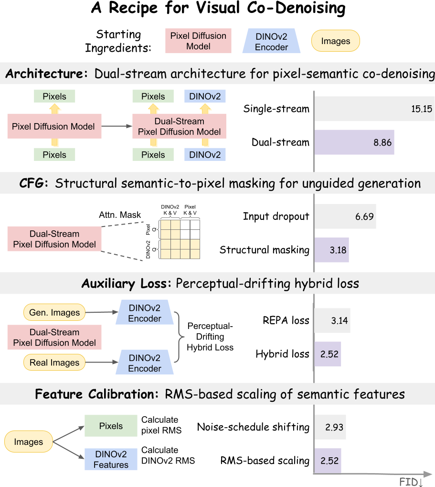

## V-Co: A Closer Look at Visual Representation Alignment via Co-Denoising

Official implementation of V-Co, a systematic study of visual co-denoising within a unified pixel-space diffusion framework.

[](https://arxiv.org/abs/2404.09967)
[](https://huggingface.co/hanlincs/V-Co)


<p align="center">
  
</p>

V-Co present a principled study of visual representation alignment via co-denoising in pixel-space diffusion, systematically isolating the effects of architecture, CFG design, auxiliary losses, and feature calibration. We introduce an effective recipe for visual co-denoising with two key innovations: structural masking for unconditional CFG prediction and a perceptual-drifting hybrid loss that combines instance-level alignment with distribution-level regularization. Our study further identifies a fully dual-stream architecture and RMS-based feature calibration as the preferred design choices. These designs yield strong improvements on ImageNet-256~\cite{deng2009imagenet}, outperforming the underlying pixel-space diffusion baseline (i.e., JiT) as well as prior pixel-space diffusion methods.


# 🔥 News
- **Mar 17, 2026**: We release the complete V-Co codebase, including training and inference scripts, and pretrained checkpoints for all model variants (B/16, L/16, H/16) 🎉


# 🔧 Setup


## Dataset
[ImageNet](http://image-net.org/download) dataset is used for V-Co training.


## Environment
Download the code:
```
git clone https://github.com/HL-hanlin/V-Co.git
cd V-Co
```

```
conda create -n vco python=3.10 -y && conda activate vco

pip install -r requirements.txt
```


# 🚅 Training

We provide both single-node and multi-node training scripts for VCo-B/16, VCo-L/16, and VCo-H/16 on ImageNet at 256×256 resolution under `scripts/train/`. By default, our implementation uses a global batch size of 1024, following JiT. You may adjust the number of GPUs or nodes based on your available GPU memory.


Below is an example script for training VCo-B/16 on ImageNet at 256×256 resolution for 600 epochs using 8 A100 GPUs:
```
torchrun --nproc_per_node=8 --nnodes=1 \
    main_vco.py \
    --proj_dropout 0.0 \
    --P_mean -0.8 --P_std 0.8 \
    --img_size 256 --noise_scale 1.0 \
    --batch_size 128 --blr 5e-5 \
    --epochs 600 --warmup_epochs 5 \
    --gen_bsz 128 --num_images 50000 --interval_min 0.1 --interval_max 1.0 --eval_freq 20 \
    --auto_resume \
    --online_eval \
    --use_wandb \
    --model JiT-B/16-co \
    --output_dir '/path/to/output_dir' \
    --wandb_entity 'your_entity' \
    --wandb_run_name 'vco_base' \
    --data_path '/path/to/imagenet/' \
    --num_workers 12 \
    --use_co_embed \
    --use_dinov2 \
    --use_dino_from_rae \
    --dinov2_loss_coef 0.1 \
    --use_gated_co_embed \
    --noise_scale_dinov2 1.0 \
    --jit_refiner_layers 0 \
    --use_mmdit \
    --separate_qkv \
    --use_conv2d_dino_proj \
    --label_drop_prob 0.0 \
    --dinov2_drop_prob 0.0 \
    --label_dinov2_drop_prob 0.1 \
    --uncond_dino_null \
    --dinov2_null_type 'attn_mask_asymmetric' \
    --dinov2_drop_zero_loss \
    --cfg 1.8 \
    --cfg_dino 1.8 \
    --class_balanced_sampling \
    --num_classes_per_batch 1 \
    --num_samples_per_class 128 \
    --drifting_v3_loss \
    --drifting_v3_loss_coef 10.0 \
    --drifting_v3_feat_type 'cls' \
    --drifting_v3_gate_tau 10 \
    --drifting_v3_repulsion_tau 0.2

```

Below is an example script for training VCo-B/16 on ImageNet 256x256 for 600 epochs on multi-nodes using SLURM:
```
bash scripts/train/vco_base.sh
```

📌 Remember to set --output_dir and --wandb_entity in the training script, and specify --data_path as the directory where the ImageNet dataset is stored.

📌 We also provide training scripts under scripts/train/ to reproduce the other key design choices reported in Tables 1–4.


# 🔮 Evaluation


We provide single-node script for evaluating VCo-B/16, VCo-L/16, and VCo-H/16 under the folder `scripts/eval/`.

For example, to evaluate pre-trained VCo-B:
```
torchrun --nproc_per_node=8 --nnodes=1 \
    main_vco.py \
    --P_mean -0.8 --P_std 0.8 \
    --img_size 256 \
    --batch_size 32 \
    --gen_bsz 32 \
    --resume '/path/to/vco_base/checkpoint.pth' \
    --online_eval \
    --model JiT-B/16-co \
    --output_dir '/path/to/output_dir' \
    --data_path '/path/to/imagenet/' \
    --evaluate_gen \
    --num_workers 12 \
    --use_co_embed \
    --use_dinov2 \
    --use_dino_from_rae \
    --use_gated_co_embed \
    --use_mmdit \
    --separate_qkv \
    --use_conv2d_dino_proj \
    --uncond_dino_null \
    --dinov2_null_type 'attn_mask_asymmetric' \
    --dinov2_drop_zero_loss \
    --class_balanced_sampling \
    --drifting_v3_loss \
    --cfg_sweep '1.8'
```

📌 To evaluate a pretrained model, simply add two additional arguments to the same training script: `--evaluate_gen` to enable evaluation mode, and `--resume` to specify the path to the .pth checkpoint to be evaluated. We have open-sourced our pretrained V-Co-Base/Large/Huge models on HuggingFace at https://huggingface.co/hanlincs/V-Co. You can download the desired checkpoint and set `--resume` to its local path.

# 📚 BibTeX

🌟 If you find our project useful in your research or application development, citing our paper would be the best support for us!

```
@article{lin2026vco,
  title={V-Co: A Closer Look at Visual Representation Alignment via Co-Denoising},
  author={Lin, Han and Pan, Xichen and Wang, Zun and Zhang, Yue and Chu, Wang and Jaemin, Cho and Bansal, Mohit},
  journal={arXiv preprint arXiv:},
  year={2026}
}
```


# 🙏 Acknowledgements
The development of V-Co has been greatly inspired by the following amazing works and teams:

- [JIT](https://github.com/LTH14/JiT)
- [Latent Forcing](https://github.com/AlanBaade/LatentForcing)

We hope that releasing this model/codebase helps the community to continue pushing these creative tools forward in an open and responsible way.
